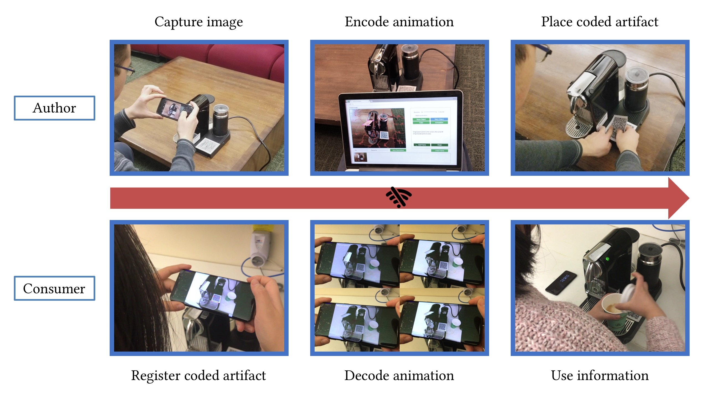

# AniCode: Authoring Coded Artifacts for Network-Free Personalized Animations

by Zeyu Wang, Shiyu Qiu, Qingyang Chen, Alexander Ringlein, Julie Dorsey, and Holly Rushmeier

Conditionally accepted to the Visual Computer (CGI 2019)

## Source code will be released in this repository

## A live demo is available at http://tracer.cs.yale.edu/anicode
